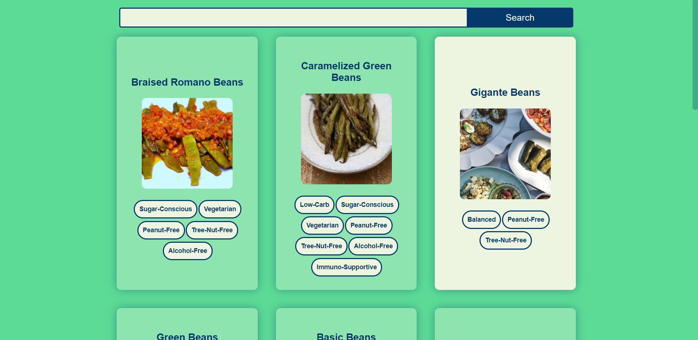

# Tonight-Recipe

**Developed by** Carthur Pongpatimet

A web application that allows user to search different recipe ideas based on ingredients and recipe keywords. The application was developed using React and CSS for the frontend and uses Edamam recipe search API (Link: https://developer.edamam.com/edamam-docs-recipe-api) to collect recipe data based on user's input. The project was created using the npm library <code>create-react-app</code>. (Link: https://www.npmjs.com/package/create-react-app)

**Please note** that the Edamam API used is a free developer version which limits the number of searches to only 5 per minutes. If the search does not work, please wait for a minute and try again. If the search still does not work, please notify the developer by leaving a ticket issue.   

Checkout out the web application by clicking the link below:  
[Link here]

# Technologies Used
React  
HTML  
CSS  
Edamam Recipe Search API  

# Things I Did
- Using React framework
- Building React components class
- Using props and state
- Passing props between components
- Logic rendering
- Using an API to fetch data
- Using CSS flexbox
- Using CSS webkit (customized scrollbar)
- Responsive design

# Installation
To run the project locally using the source code

## Prerequisite
You must have npm install on your machine which is installed with nodejs. Follow the link below to download the latest version of nodejs

nodejs download: https://nodejs.org/en/download/

1. Clone this repo and go into the directory <code>tonight-recipe</code>
2. Run <code>npm install</code> to get all the project's dependency 
3. Run <code>npm run start</code> to run the script that will serve to application locally (localhost:3000) 

# Application
The user will be greeted with the title page which will contain a search bar that the user can use to search different recipe ideas. User can enter any ingredient or food keyword into this search bar to find related recipes based on the search criteria. Once they clicked the search button, the application will find some recipe ideas and display them to the user. Each recipe cards will show the name of the recipe, image and some food label associated with the recipe. For example, non-dairy, vegetarian, gluten-free etc. The user can expand the recipe by click on the recipe cards. This will then popup an expanded view of the recipe showing all the ingredients/measurements needed, number of servings and calorie number of the recipe. If the application cannot find any recipe, the user will be prompted.  

## Title Page

# Searching

# Recipe Found

# Recipe Expanded

# No Recipe found

